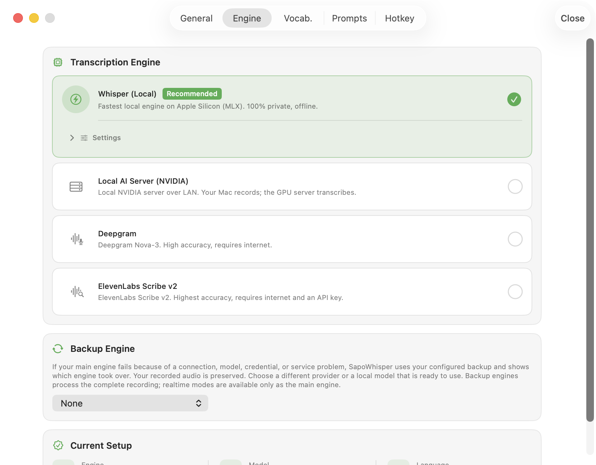

<p align="center">
  
</p>
<h1 align="center">SapoWhisper</h1>

SapoWhisper is a fast speech-to-text app for Apple Silicon Macs. Press the global shortcut, speak, press it again, and the transcript is pasted into the app you were using.

<p align="center">
  <a href="https://github.com/StevenACZ/SapoWhisper/releases/latest">Download for macOS</a>
  · <a href="CHANGELOG.md">What's new</a>
  · <a href="https://github.com/StevenACZ/SapoWhisper/issues">Report an issue</a>
</p>



## What it does

- Records from a configurable global shortcut. The default is `Option + Space`, and a double-modifier shortcut is also available.
- Transcribes locally, through a local NVIDIA server, or with supported cloud providers.
- Offers realtime dictation with saved audio and an optional backup that processes the complete recording.
- Keeps searchable History with playback, status details, and re-transcription using another engine.
- Lets you pause, resume, or cancel a recording, and recover interrupted takes after relaunch.
- Keeps a personal vocabulary for names and technical terms.
- Optionally cleans up or translates transcripts with an OpenAI-compatible AI provider.
- Includes English and Spanish interfaces plus signed one-click updates.

## Install

SapoWhisper requires macOS 14 or later on an Apple Silicon Mac.

1. Download the latest `SapoWhisper-*.dmg` from [Releases](https://github.com/StevenACZ/SapoWhisper/releases/latest).
2. Drag SapoWhisper into Applications.
3. Open it and grant Microphone permission. Grant Accessibility permission for automatic paste; double-modifier shortcuts also require Input Monitoring.
4. Choose a transcription engine and add that provider's credential when required. For a local server, allow Local Network access when macOS asks.

Existing users can update from inside the app.

## Transcription engines

| Engine | Mode | Use case |
| --- | --- | --- |
| Whisper MLX | Local | Offline transcription after downloading a model |
| Local AI Server | Local network | Offload transcription to an NVIDIA server |
| Deepgram Nova-3 | Cloud batch | Accurate completed recordings |
| Deepgram Flux | Cloud realtime | Fast live dictation |
| ElevenLabs Scribe | Cloud batch or realtime | Scribe transcription |

## Your recordings and vocabulary

Recordings and transcripts stay in local History under your retention settings. If processing fails or is cancelled, open History to retry the saved audio. Recoverable interrupted recordings can also be continued after relaunch.

Your custom vocabulary and automatic corrections start empty on a fresh setup. Add your own names and terms as you go; they are kept in your local profile and preserved across app updates.

Local MLX processes audio on your Mac. Cloud engines and your configured server receive the audio and recognition hints needed for transcription. Optional AI polish sends text to your chosen provider for cleanup or translation. API keys live in the macOS Keychain. See [SECURITY.md](SECURITY.md) for details.

## Build from source

Building requires Xcode, the Metal Toolchain, and `gitleaks`.

```bash
git clone https://github.com/StevenACZ/SapoWhisper.git
cd SapoWhisper
make tools
make ci-check
```

Open `SapoWhisper.xcodeproj` and run the `SapoWhisper` scheme. Development setup lives in [CONTRIBUTING.md](CONTRIBUTING.md), component responsibilities in [ARCHITECTURE.md](ARCHITECTURE.md), and evaluation methods in [BENCHMARKS.md](BENCHMARKS.md).

## License

[MIT](LICENSE)
